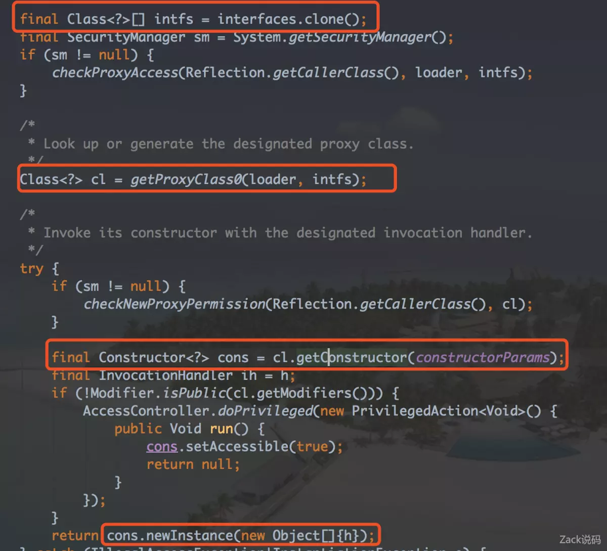

动态代理看起来好像是个什么高大上的名词，但其实并没有那么复杂，直接从字面就很容易理解。动态地代理，可以猜测一下它的含义，在运行时动态地对某些东西代理，代理它做了其他事情。先不去搞清楚这个动态代理真正的含义，我们来举个生动的例子来理解下它到底做了什么。

# 一个例子

一个程序员**Developer**，他会开发code，他调试debug。

```java
public interface Developer {    
    public void code();    
    public void debug();
}
```

程序员有很多分类，其中有Java程序员**JavaDeveloper**，他会开发Java代码，会调试Java代码。

```java
public class JavaDevloper implements Developer {
    private String name;

    public JavaDevloper(String name) {
        this.name = name;
    }

    @Override
    public void code() {
        System.out.println(name + " is coding java");
    }

    @Override
    public void debug() {
        System.out.println(name + " is debugging java");
    }
}
```

但是呢，有个叫张三的程序员它在开发之前，会祈祷一下，这样他开发的代码就不会有bug。


张三的这种“特异功能”是后天练出来的，并没有哪种程序员有这种特性。虽然我们也可以定义一个拥有这样特性的程序员，但是拥有各种乱七八糟特性的程序千千万。我们什么时候才能定义完，而能保证不漏呢？

其实我们没有必要去定义他，因为他是后天养成的，我们应该在这个程序员的成长期去实现这个特性，而不是在他出生之前定义。

我们来看下代码是怎么实现的

```java
public class JavaDynamicProxy{
    public static void main(String[] args) {
        JavaDevloper zhangsan = new JavaDevloper("zhangsan");
        //现在已经在程序运行中了，而下面这个类是在运行时动态创建的一个代理类。
        Developer zhangsanProxy = (Developer) Proxy.newProxyInstance(zhangsan.getClass().getClassLoader(),
                zhangsan.getClass().getInterfaces(), (proxy, method, args1) -> {
                    if (method.getName().equals("code")) {
                        System.out.println("zhangshan is praying for the code");
                        return method.invoke(zhangsan, args1);
                    }
                    if (method.getName().equals("debug")) {
                        System.out.println("zhangsan's have no bug, no need to debug!");
                        return null;
                    }
                    return null;
                });
        zhangsanProxy.code();
        zhangsanProxy.debug();
    }
}
```

如果张三只是一个普通的Java程序员，那么他的开发结果是
zhangsan is coding java
zhangsan is debugging java

但是真正的张三（代理后）
zhangsan is praying for the code!
zhangsan is coding java
zhangsan have no bug！No need to debug!

# Proxy.newProxyInstance()

回看下上面是如何使用动态代理的使用。生成一个实例对象，然后用Proxy的newInstance方法对这个实例对象代理生成一个代理对象。

```java
Developer zhangsanProxy = (Developer) Proxy.newProxyInstance(zhangsan.getClass().getClassLoader(),
                zhangsan.getClass().getInterfaces(), (proxy, method, args1) -> {
                    if (method.getName().equals("code")) {
```

这里有一个非常关键的点，也是比较少人去理解它的。为什么要传zhangsan的类加载和zhangsan的接口呢？
有没有留意到zhangsanProxy的类型是Developer接口，而不是一个实现类。因为zhangsan在被代理后生成的对象，并不属于Developer接口的任何一个实现类。但是它是基于Developer接口和zhangsan的类加载代理出来的。

看下newProxyInstance()的接口定义

```java
    @CallerSensitive
    public static Object newProxyInstance(ClassLoader loader,
                                          Class<?>[] interfaces,
                                          InvocationHandler h)
```

- loder，选用的类加载器。因为代理的是zhangsan，所以一般都会用加载zhangsan的类加载器。
- interfaces，被代理的类所实现的接口，这个接口可以是多个。
- h，绑定代理类的一个方法。

loder和interfaces基本就是决定了这个类到底是个怎么样的类。而h是InvocationHandler，决定了这个代理类到底是多了什么功能。所以动态代理的内容重点就是这个InvocationHandler。

# InvocationHandler

InvocationHandler作用就是，当代理对象的原本方法被调用的时候，会绑定执行一个方法，这个方法就是InvocationHandler里面定义的内容，同时会替代原本方法的结果返回。

InvocationHandler接收三个参数

- proxy，代理后的实例对象。
- method，对象被调用方法。
- args，调用时的参数。

在上面的例子里，如果最后的return语句改成

```bash
return method.invoke(proxy, agrs);
```

这里只有一个名为invoke()的方法，不管代理被调用的是何种方法，处理器被调用的一定是invoke()方法。

**invoke的对象不是zhangsan，而是proxy，根据上面的说明猜猜会发生什么？**
是的，会不停地循环调用。因为proxy是代理类的对象，当该对象方法被调用的时候，会触发InvocationHandler，而InvocationHandler里面又调用一次proxy里面的对象，所以会不停地循环调用。并且，proxy对应的方法是没有实现的。所以是会循环的不停报错

# 动态代理的原理

通过上面的讲解，相信大家对动态代理的使用理解得比较深刻了。那动态代理到底是怎么实现的呢，我们来看看源码其中关键的地方。
在newProxyInstance()发放中有这样几段。

其实大概就是把接口复制出来，通过这些接口和类加载器，拿到这个代理类cl。然后通过反射的技术复制拿到代理类的构造函数（这部分代码在Class类中的getConstructor0方法），最后通过这个构造函数new个一对象出来，同时用InvocationHandler绑定这个对象。

# 动态代理的使用场景

动态代理的好处我们从例子就能看出来，它比较灵活，可以在运行的时候才切入改变类的方法，而不需要预先定义它。

动态代理一般我们比较少去手写，但我们用得其实非常多。在Spring项目中用的注解，例如依赖注入的@Bean、@Autowired，事务注解@Transactional等都有用到，换言之就是Srping的AOP（切面编程）。

这种场景的使用是动态代理最佳的落地点，可以非常灵活地在某个类，某个方法，某个代码点上切入我们想要的内容，就是动态代理其中的内容。所以下一篇我们来细致了解下Spring的AOP到底是怎么使用动态代理的。
